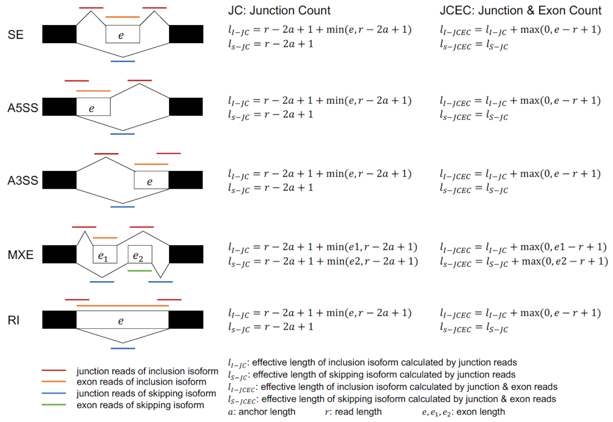

# rMATS turbo v4.1.2

[](https://github.com/Xinglab/rmats-turbo/releases/latest)
[](https://github.com/Xinglab/rmats-turbo/releases)
[](https://anaconda.org/bioconda/rmats)
[](http://rnaseq-mats.sourceforge.net)
[](https://hub.docker.com/r/xinglab/rmats)

## About

rMATS turbo is the C/Cython version of rMATS (refer to http://rnaseq-mats.sourceforge.net). The major difference between rMATS turbo and rMATS is speed and space usage. rMATS turbo is 100 times faster and the output file is 1000 times smaller than rMATS. These advantages make analysis and storage of a large scale dataset easy and convenient.

|  | Counting part | Statistical part |
|---|---|---|
| Speed (C/Cython version vs Python version) | 20~100 times faster (one thread) | 300 times faster (6 threads) |
| Storage usage (C/Cython version vs Python version) | 1000 times smaller | - |

## Table of contents

- [Dependencies](#dependencies)
- [Build](#build)
- [Test](#test)
- [Usage](#usage)
  * [Examples](#examples)
    + [Starting with FASTQ files](#starting-with-fastq-files)
    + [Starting with BAM files](#starting-with-bam-files)
    + [Running prep and post separately](#running-prep-and-post-separately)
    + [Using the paired stats model](#using-the-paired-stats-model)
    + [Running the statistical model separately](#running-the-statistical-model-separately)
  * [Tips](#tips)
  * [All arguments](#all-arguments)
- [Output](#output)

## Dependencies

Tested with

- Python (3.6.12 or 2.7.15)
  * Cython (0.29.21 or 0.29.15 for Python 2)
  * numpy (1.16.6 or 1.16.5 for Python 2)
- BLAS, LAPACK
- GNU Scientific Library (GSL 2.5)
- GCC (>=5.4.0)
- gfortran (Fortran 77)
- CMake (3.15.4)
- [PAIRADISE](https://github.com/Xinglab/PAIRADISE) (optional)
- Samtools (optional)
- STAR (optional)

## Build

If the required dependencies are already installed, then rMATS can be built with:
```
./build_rmats
```

And then run with:
```
python rmats.py {arguments}
```

The [build_rmats](build_rmats) script usage is:
```
./build_rmats [--conda] [--no-paired-model]

--conda: create a conda environment for Python and R dependencies
--no-paired-model: do not install dependencies for the paired model
```

With `--conda` [build_rmats](build_rmats) installs a conda environment that satisfies the required Python dependencies and also the R dependencies needed to use the paired model (PAIRADISE). The Python dependencies are listed in [python_conda_requirements.txt](python_conda_requirements.txt) and the R dependencies are handled using [r_conda_requirements.txt](r_conda_requirements.txt) and [install_r_deps.R](install_r_deps.R) after cloning the PAIRADISE git repo.


[run_rmats](run_rmats) is a wrapper to call [rmats.py](rmats.py) with the conda environment used by [build_rmats](build_rmats). It also sources [setup_environment.sh](setup_environment.sh) which can be modified to handle other setup that might be needed before running rmats (such as Environment Modules).


If rMATS was built with `./build_rmats --conda` then it should be run with:
```
./run_rmats {arguments}
```

## Test

[test_rmats](test_rmats) creates a conda environment and uses [run_rmats](run_rmats) to run the automated tests in [tests/](tests/)

## Usage

### Examples

#### Starting with FASTQ files

Suppose there are 2 sample groups with 2 sets of paired read (R1, R2) FASTQ files per group. (`fastq.gz` files can also be used)

- group 1 FASTQs
  * `/path/to/1_1.R1.fastq`
  * `/path/to/1_1.R2.fastq`
  * `/path/to/1_2.R1.fastq`
  * `/path/to/1_2.R2.fastq`
- group 2 FASTQs
  * `/path/to/2_1.R1.fastq`
  * `/path/to/2_1.R2.fastq`
  * `/path/to/2_2.R1.fastq`
  * `/path/to/2_2.R2.fastq`

Create txt files that will be used to pass this grouping of inputs to rMATS. The expected format is `:` to separate paired reads and `,` to separate replicates.
- `/path/to/s1.txt`
```
/path/to/1_1.R1.fastq:/path/to/1_1.R2.fastq,/path/to/1_2.R1.fastq:/path/to/1_2.R2.fastq
```
- `/path/to/s2.txt`
```
/path/to/2_1.R1.fastq:/path/to/2_1.R2.fastq,/path/to/2_2.R1.fastq:/path/to/2_2.R2.fastq
```

Details about the remaining arguments are discussed in [All arguments](#all-arguments)


run rMATS on this input with:
```
python rmats.py --s1 /path/to/s1.txt --s2 /path/to/s2.txt --gtf /path/to/the.gtf --bi /path/to/STAR_binary_index -t paired --readLength 50 --nthread 4 --od /path/to/output --tmp /path/to/tmp_output
```

rMATS will first process the FASTQ input into BAM files stored in the `--tmp` directory. Then the splicing analysis will be performed.

#### Starting with BAM files

Reads can be mapped independently of rMATS with any aligner and then the resulting BAM files can be used as input to rMATS. rMATS requires aligned reads to match --readLength unless --variable-read-length is given. rMATS also ignores alignments with soft or hard clipping unless --allow-clipping is given.

Suppose there are 2 sample groups with 2 BAM files per group.

- group 1 BAMs
  * `/path/to/1_1.bam`
  * `/path/to/1_2.bam`
- group 2 BAMs
  * `/path/to/2_1.bam`
  * `/path/to/2_2.bam`

Create txt files that will be used to pass this grouping of inputs to rMATS. The expected format is `,` to separate replicates.
- `/path/to/b1.txt`
```
/path/to/1_1.bam,/path/to/1_2.bam
```
- `/path/to/b2.txt`
```
/path/to/2_1.bam,/path/to/2_2.bam
```

Details about the remaining arguments are discussed in [All arguments](#all-arguments)


run rMATS on this input with:
```
python rmats.py --b1 /path/to/b1.txt --b2 /path/to/b2.txt --gtf /path/to/the.gtf -t paired --readLength 50 --nthread 4 --od /path/to/output --tmp /path/to/tmp_output
```

#### Running prep and post separately

rMATS analysis has two steps, prep and post. In the prep step, the input files are processed and a summary is saved to `.rmats` files in the `--tmp` directory. The `.rmats` files track info from each BAM separately according to the full path of the BAM specified in the input `.txt` file. In the post step, `.rmats` files are read and the final output files are created.


The `--task` argument allows the prep step of rMATS to be run independently for different subsets of input BAM files. Then the post step can be run on the independently generated `.rmats` files. This allows the computation to be run at different times and/or on different machines.


Suppose we have 8 BAMs and two machines that each have 4 CPU threads. Each machine can run the prep step on 4 BAMs concurrently. Then the post step can be run on one of the machines.


Split the BAMs into two groups. The assignment of BAMs to prep steps does not restrict the choice of `--b1` and `--b2` for a later post step.

- `/path/to/prep1.txt`
```
/path/to/1.bam,/path/to/2.bam,/path/to/3.bam,/path/to/4.bam
```
- `/path/to/prep2.txt`
```
/path/to/5.bam,/path/to/6.bam,/path/to/7.bam,/path/to/8.bam
```

On machine 1 run the prep step with prep1.txt:
```
python rmats.py --b1 /path/to/prep1.txt --gtf /path/to/the.gtf -t paired --readLength 50 --nthread 4 --od /path/to/output --tmp /path/to/tmp_output_prep_1 --task prep
```
On machine 2 run the prep step with prep2.txt:
```
python rmats.py --b1 /path/to/prep2.txt --gtf /path/to/the.gtf -t paired --readLength 50 --nthread 4 --od /path/to/output --tmp /path/to/tmp_output_prep_2 --task prep
```

Split the BAMs into two groups. This split is for statistically comparing the two groups and does not need to reflect the split used in the prep steps

- `/path/to/post1.txt`
```
/path/to/1.bam,/path/to/3.bam,/path/to/8.bam
```
- `/path/to/post2.txt`
```
/path/to/2.bam,/path/to/4.bam,/path/to/5.bam,/path/to/6.bam,/path/to/7.bam
```

Copy the `.rmats` files from the separate prep steps to a directory so that the post step can access all the prep data. The filenames have the format `{datetime}_{id}.rmats` and the filenames may conflict for prep steps run concurrently. The script [cp_with_prefix.py](cp_with_prefix.py) is provided to disambiguate the `.rmats` filenames when copying to a shared directory:
```
python cp_with_prefix.py prep_1_ /path/to/tmp_output_post/ /path/to/tmp_output_prep_1/*.rmats
python cp_with_prefix.py prep_2_ /path/to/tmp_output_post/ /path/to/tmp_output_prep_2/*.rmats
```

On machine 1 run the post step:
```
python rmats.py --b1 /path/to/post1.txt --b2 /path/to/post2.txt --gtf /path/to/the.gtf -t paired --readLength 50 --nthread 4 --od /path/to/output --tmp /path/to/tmp_output_post --task post
```

#### Using the paired stats model

The default statistical model considers the samples to be unpaired. The `--paired-stats` flag can be used if each entry in `--b1` is matched with its pair in `--b2`. As an example, if there are three replicates where each replicate has paired "a" and "b" data, then b1.txt and b2.txt should look like:

- `/path/to/b1.txt`
```
/path/to/pair_1_a.bam,/path/to/pair_2_a.bam,/path/to/pair_3_a.bam
```
- `/path/to/b2.txt`
```
/path/to/pair_1_b.bam,/path/to/pair_2_b.bam,/path/to/pair_3_b.bam
```

The `--paired-stats` flag can then be given so that the paired statistical model is used instead of the default unpaired model. As the paired model is running it updates a progress file under the `--od` directory. As an example `/path/to/od/tmp/JC_SE/pairadise_status.txt` is written when the paired model is producing the results for `SE.MATS.JC.txt`.

#### Running the statistical model separately

The rMATS statistical model requires an event definition file (`fromGTF.[AS].txt`) and a count file (`{JC,JCEC}.raw.input.[AS].txt`) as input. Usually those files are created by the post step which also runs the statistical model to create the final output file (`[AS].MATS.{JC,JCEC}.txt`). There may be situations where the event definitions and counts are already available and the statistical model can be run on those existing files with

```
python rmats.py --od /path/to/dir_with_existing_files --tmp /path/to/tmp_dir --task stat
```

One use case for `--task stat` is when there are more than two groups to compare. For example, if there are 3 sample groups, then it is possible to compare each sample group to the other two (1 to 2, 1 to 3, 2 to 3). This can be done by first processing all the samples together using the usual rMATS pipeline

* Run the prep step for each BAM (can utilize multiple compute nodes)
* Combine all the prep results in a single post step (`--statoff`)

After all of the BAMs have been processed in this way, the output directory will contain the necessary `fromGTF.[AS].txt` and `{JC,JCEC}.raw.input.[AS].txt` files. The `fromGTF.[AS].txt` files can be used "as is" for all comparisons involving the samples, but the information that is relevant to a specific comparison needs to be extracted from the `{JC,JCEC}.raw.input.[AS].txt` files. This can be done using [rMATS_P/prepare_stat_inputs.py](rMATS_P/prepare_stat_inputs.py). If there are 3 replicates in each of the 3 groups and they were provided in the `--b1` argument of the post step in ascending order (`group_1_rep_1, group_1_rep_2, ..., group_3_rep_3`) then the comparisons can be performed by

* `python rMATS_P/prepare_stat_inputs.py --new-output-dir /path/to/1_to_2_output --old-output-dir /path/to/combined_post_output --group-1-indices 0,1,2 --group-2-indices 3,4,5`
* `python rmats.py --od /path/to/1_to_2_output --tmp /path/to/1_to_2_tmp --task stat`
* `python rMATS_P/prepare_stat_inputs.py --new-output-dir /path/to/1_to_3_output --old-output-dir /path/to/combined_post_output --group-1-indices 0,1,2 --group-2-indices 6,7,8`
* `python rmats.py --od /path/to/1_to_3_output --tmp /path/to/1_to_3_tmp --task stat`
* `python rMATS_P/prepare_stat_inputs.py --new-output-dir /path/to/2_to_3_output --old-output-dir /path/to/combined_post_output --group-1-indices 3,4,5 --group-2-indices 6,7,8`
* `python rmats.py --od /path/to/2_to_3_output --tmp /path/to/2_to_3_tmp --task stat`

### Tips

- The statistical comparison between the two input sample groups can be skipped with `--statoff`. It is also possible to use a single sample group (only `--b1` or `--s1`) when using `--statoff`.
- The number of replicates can differ between sample 1 and sample 2 (example: 3 BAMs in `--b1` and 1 BAM in `--b2`)
- `fastq.gz` files can be used with `--s1`, `--s2`. They will be automatically detected based on the `.gz` extension and decompressed
- A cluster environment can be utilized to run many prep steps concurrently and when the prep steps are finished a single post step can be run.
- When splitting the computation using `--task {prep, post}`, rMATS will consider all `.rmats` files in the `--tmp` directory when running the post step. The `.rmats` files from multiple prep steps can be copied to a shared location for running the post step. Replacing `--task post` in the command line that is going to be used for the post step with `--task inte` will perform an integrity check to verify that the BAM filenames in `--b1` and `--b2` match 1-to-1 with the BAM filenames recorded in the `.rmats` files in `--tmp`.
- The `.rmats` filenames from concurrently run prep steps may conflict. The script [cp_with_prefix.py](cp_with_prefix.py) is provided to disambiguate the `.rmats` filenames when copying to a shared directory.
- The full path of the BAM files given in `--b1` and `--b2` for the prep step must match the full paths given in the post step. Otherwise the lookup into the `.rmats` file(s) will fail. As an example, if the full `/path/to/1.bam` is used in the prep step, a relative path of just `1.bam` cannot be used in the post step.
- If analyzing a small data set, `--task both` can be used to perform the prep and post steps in a single run.
- `--novelSS` is an experimental feature that allows splicing events to be detected that involve an unannotated splice site.
- `--fixed-event-set` can be set to a directory containing the `fromGTF.[AS].txt` files from a previous run of rMATS. The events in the provided files will be used directly instead of detecting events from the input reads. This can be used to run new data against the events detected from a previous rMATS run. The `fromGTF.[AS].txt` files can also be edited manually to specify a custom event set.

### All Arguments

```
python rmats.py -h

usage: rmats.py [options]

optional arguments:
  -h, --help            show this help message and exit
  --version             show program's version number and exit
  --gtf GTF             An annotation of genes and transcripts in GTF format
  --b1 B1               A text file containing a comma separated list of the
                        BAM files for sample_1. (Only if using BAM)
  --b2 B2               A text file containing a comma separated list of the
                        BAM files for sample_2. (Only if using BAM)
  --s1 S1               A text file containing a comma separated list of the
                        FASTQ files for sample_1. If using paired reads the
                        format is ":" to separate pairs and "," to separate
                        replicates. (Only if using fastq)
  --s2 S2               A text file containing a comma separated list of the
                        FASTQ files for sample_2. If using paired reads the
                        format is ":" to separate pairs and "," to separate
                        replicates. (Only if using fastq)
  --od OD               The directory for final output from the post step
  --tmp TMP             The directory for intermediate output such as ".rmats"
                        files from the prep step
  -t {paired,single}    Type of read used in the analysis: either "paired" for
                        paired-end data or "single" for single-end data.
                        Default: paired
  --libType {fr-unstranded,fr-firststrand,fr-secondstrand}
                        Library type. Use fr-firststrand or fr-secondstrand
                        for strand-specific data. Default: fr-unstranded
  --readLength READLENGTH
                        The length of each read
  --variable-read-length
                        Allow reads with lengths that differ from --readLength
                        to be processed. --readLength will still be used to
                        determine IncFormLen and SkipFormLen
  --anchorLength ANCHORLENGTH
                        The anchor length. Default is 1
  --tophatAnchor TOPHATANCHOR
                        The "anchor length" or "overhang length" used in the
                        aligner. At least "anchor length" NT must be mapped to
                        each end of a given junction. The default is 6. (Only
                        if using fastq)
  --bi BINDEX           The directory name of the STAR binary indices (name of
                        the directory that contains the SA file). (Only if
                        using fastq)
  --nthread NTHREAD     The number of threads. The optimal number of threads
                        should be equal to the number of CPU cores. Default: 1
  --tstat TSTAT         The number of threads for the statistical model. If
                        not set then the value of --nthread is used
  --cstat CSTAT         The cutoff splicing difference. The cutoff used in the
                        null hypothesis test for differential splicing. The
                        default is 0.0001 for 0.01% difference. Valid: 0 <=
                        cutoff < 1. Does not apply to the paired stats model
  --task {prep,post,both,inte,stat}
                        Specify which step(s) of rMATS to run. Default: both.
                        prep: preprocess BAMs and generate a .rmats file.
                        post: load .rmats file(s) into memory, detect and
                        count alternative splicing events, and calculate P
                        value (if not --statoff). both: prep + post. inte
                        (integrity): check that the BAM filenames recorded by
                        the prep task(s) match the BAM filenames for the
                        current command line. stat: run statistical test on
                        existing output files
  --statoff             Skip the statistical analysis
  --paired-stats        Use the paired stats model
  --novelSS             Enable detection of novel splice sites (unannotated
                        splice sites). Default is no detection of novel splice
                        sites
  --mil MIL             Minimum Intron Length. Only impacts --novelSS
                        behavior. Default: 50
  --mel MEL             Maximum Exon Length. Only impacts --novelSS behavior.
                        Default: 500
  --allow-clipping      Allow alignments with soft or hard clipping to be used
  --fixed-event-set FIXED_EVENT_SET
                        A directory containing fromGTF.[AS].txt files to be
                        used instead of detecting a new set of events
```

## Output

Each alternative splicing event type has a corresponding set of output files. In the filename templates below `[AS_Event]` is replaced by one of [SE (skipped exon), MXE (mutually exclusive exons), A3SS (alternative 3' splice site), A5SS (alternative 5' splice site), RI (retained intron)] for the event specific filename.




`--od` contains the final output files from the post step:

- `[AS_Event].MATS.JC.txt`: Final output including only reads that span junctions defined by rmats (Junction Counts)
- `[AS_Event].MATS.JCEC.txt`: Final output including both reads that span junctions defined by rmats (Junction Counts) and reads that do not cross an exon boundary (Exon Counts)
- `fromGTF.[AS_Event].txt`: All identified alternative splicing (AS) events derived from GTF and RNA
- `fromGTF.novelJunction.[AS_Event].txt`: Alternative splicing (AS) events which were identified only after considering the RNA (as opposed to analyzing the GTF in isolation). This does not include events with an unannotated splice site.
- `fromGTF.novelSpliceSite.[AS_Event].txt`: This file contains only those events which include an unannotated splice site. Only relevant if `--novelSS` is enabled.
- `JC.raw.input.[AS_Event].txt`: Event counts including only reads that span junctions defined by rmats (Junction Counts)
- `JCEC.raw.input.[AS_Event].txt`: Event counts including both reads that span junctions defined by rmats (Junction Counts) and reads that do not cross an exon boundary (Exon Counts)
- Shared columns:
  * `ID`: rMATS event id
  * `GeneID`: Gene id
  * `geneSymbol`: Gene name
  * `chr`: Chromosome
  * `strand`: Strand of the gene
  * `IJC_SAMPLE_1`: Inclusion counts for sample 1. Replicates are comma separated
  * `SJC_SAMPLE_1`: Skipping counts for sample 1. Replicates are comma separated
  * `IJC_SAMPLE_2`: Inclusion counts for sample 2. Replicates are comma separated
  * `SJC_SAMPLE_2`: Skipping counts for sample 2. Replicates are comma separated
  * `IncFormLen`: Length of inclusion form, used for normalization
  * `SkipFormLen`: Length of skipping form, used for normalization
  * `PValue`: Significance of splicing difference between the two sample groups. (Only available if the statistical model is on)
  * `FDR`: False Discovery Rate calculated from p-value. (Only available if statistical model is on)
  * `IncLevel1`: Inclusion level for sample 1. Replicates are comma separated. Calculated from normalized counts
  * `IncLevel2`: Inclusion level for sample 2. Replicates are comma separated. Calculated from normalized counts
  * `IncLevelDifference`: average(IncLevel1) - average(IncLevel2)
- Event specific columns (event coordinates):
  * SE: `exonStart_0base` `exonEnd` `upstreamES` `upstreamEE` `downstreamES` `downstreamEE`
    + The inclusion form includes the target exon (`exonStart_0base`, `exonEnd`)
  * MXE: `1stExonStart_0base` `1stExonEnd` `2ndExonStart_0base` `2ndExonEnd` `upstreamES` `upstreamEE` `downstreamES` `downstreamEE`
    + If the strand is `+` then the inclusion form includes the 1st exon (`1stExonStart_0base`, `1stExonEnd`) and skips the 2nd exon
    + If the strand is `-` then the inclusion form includes the 2nd exon (`2ndExonStart_0base`, `2ndExonEnd`) and skips the 1st exon
  * A3SS, A5SS: `longExonStart_0base` `longExonEnd` `shortES` `shortEE` `flankingES` `flankingEE`
    + The inclusion form includes the long exon (`longExonStart_0base`, `longExonEnd`) instead of the short exon (`shortES` `shortEE`)
  * RI: `riExonStart_0base` `riExonEnd` `upstreamES` `upstreamEE` `downstreamES` `downstreamEE`
    + The inclusion form includes (retains) the intron (`upstreamEE`, `downstreamES`)
- `summary.txt`: Brief summary of all AS event types. Includes the total event counts and significant event counts. By default, events are counted as significant if FDR <= 0.05. The summary can be regenerated with different criteria by running [rMATS_P/summary.py](rMATS_P/summary.py)

`--tmp` contains the intermediate files generated by the prep step:

- `{datetime}_{id}.rmats`: Summary generated from processing a BAM
- `{datetime}_bam{sample_num}_{replicate_num}/Aligned.sortedByCoord.out.bam`: result of mapping input FASTQ files
- `{datetime}_read_outcomes_by_bam.txt`: Counts of the reads used from each BAM along with counts of the reasons that reads were not able to be used
